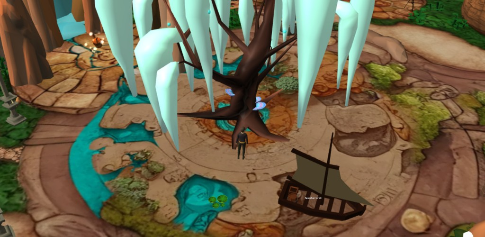
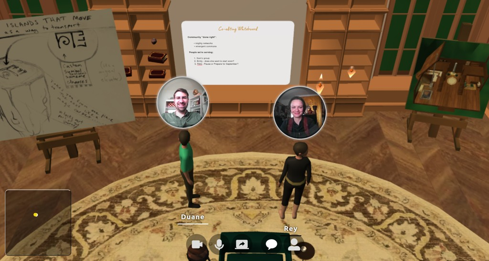
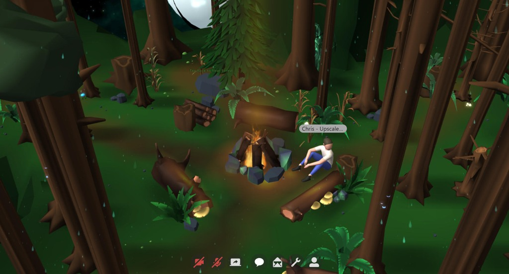

# Relm

Relm is an open source 3D spatial platform for the web. You can use it to meet, work, organize, collaborate, and hold online events.

We've been learning how to re-create a feeling of togetherness online. Flat screens and distance are the constraints within which we create a work of art. Relm has been built with a love for discovering details that help us feel comfortable, at ease, and natural as we gather with friends, family, and colleagues. We hope you'll feel the same way when you try it out.

<div>
    
    
</div>
<div>
    
    
</div>

If you use a service hosted by us or someone else, there is no setup required--it all works seamlessly in a browser.

As open source software (AGPL), you are also welcome to set it up on your own server, modify the code, and host the service for your community.

## Our Community

You're welcome to visit our [Discord server here](https://discord.gg/4HEgzrErAd).

## Local Development

To run Relm locally, you will need the following prerequisites:

1. nodejs (v14+ is recommended)
2. postgresql (v13+ is recommended)

Create an empty database called `relm`:

```
createdb relm
```

Then, clone this repo, install the dependencies and run the server:

```bash
pnpm install
pnpm dev
```

This should start both the backend server (yjs, assets, permissions) and frontend server (hosting the client javascript files). Visit http://localhost:8080/admin?token=setup to initialize a blank world and authorize your admin token.

After your first-time use, the `?token=setup` is no longer required.

## Contributing

That's very generous of you! You might like to check out the high-level [Architecture](ARCHITECTURE.md) document as well as the [Changelog](CHANGELOG.md). Please also join us on [Discord](https://discord.gg/4HEgzrErAd) if you'd like to chat, or start a [discussion](discussions).

Once you're ready, there's a directory called [contributors](contributors) where we ask you to add a file indicating your willingness to grant the same license (AGPL) as we have.

## Production Deployment

See [docs/deploy/README.md](docs/deploy/README.md)

## License

Relm's source code is licensed under the [GNU AGPL 3.0 license](LICENSE). We encourage you to use Relm for any purpose, including commercial, but with the understanding that changes to the source code must be made available to the public for the benefit of everyone.

(C) 2021-2023 Duane Johnson and other contributors
